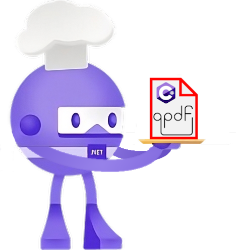

# QPdfSharp
A C# wrapper written around QPDF to allow for easy PDF manipulation.
See the below excerpt for a summary on QPDF: for further details, [consult the qpdf repository](https://github.com/qpdf/qpdf/).

> QPDF is a command-line tool and C++ library that performs content-preserving transformations on PDF files. It supports linearization, encryption, and numerous other features. It can also be used for splitting and merging files, creating PDF files (but you have to supply all the content yourself), and inspecting files for study or analysis. QPDF does not render PDFs or perform text extraction, and it does not contain higher-level interfaces for working with page contents. It is a low-level tool for working with the structure of PDF files and can be a valuable tool for anyone who wants to do programmatic or command-line-based manipulation of PDF files.
>
> The QPDF Manual is hosted online at https://qpdf.readthedocs.io. The project website is https://qpdf.sourceforge.io. The source code repository is hosted at GitHub: https://github.com/qpdf/qpdf.

## Status
This project is in its infancy. While early versions may be published, the library should **not** be considered stable until version 1.0.0 is released.

## Installation
< Installation Instructions Pending >

## Usage
QPdfSharp aims to facilitate usage of the underlying QPDF library by providing a simple, easy-to-use API that is familiar to .NET developers.

< Usage Examples Pending >

## Runtime Libraries
QPdfSharp depends on the [QPdf.RuntimeLibraries](https://www.nuget.org/packages/QPdf.RuntimeLibraries) to distribute the appropriate QPDF binaries for your platform.
Those interested in using these binaries without this library are free to do so.

The runtime libraries are checked daily for updates to qpdf; at this time QPdfSharp will manually update to the latest NuGet distribution of the libraries.

# Building and Testing

## Prerequisites
- .NET Core 8.0 SDK
- Visual Studio or Rider
- Docker (to generate interop files, if desired)
- Bash (to build NuGet package, if desired)

At present the project is simply built and ran with Rider, and no tertiary scripts are provided.
No complex deviations are expected, and the project should always be in a state where it can be pulled and built with no unusual setup.
If this is not the case, please open an issue and do not be afraid to roast me.

## From-Scratch Process
1: Clone the repository
2: Run `scripts/generate-interop.sh`. This will use CLangSharpPInvokeGenerator to generate the C# interop files.
3: Run `scripts/build-runtime-libraries-nuget.sh`. This will output a NuGet package with the latest QPDF binaries under `artifacts/QPdf.RuntimeLibraries.<version>.nupkg`.
4: Launch the repository in your IDE of choice, and verify tests pass.

# License
This project is licensed under the MIT license. See the [LICENSE](LICENSE) file for more details.

# Contributing
QPdfSharp is open to contributions to improve the library and its documentation.
I kindly ask for an issue to be opened before a pull request is made, so that we can discuss the proposed changes.
